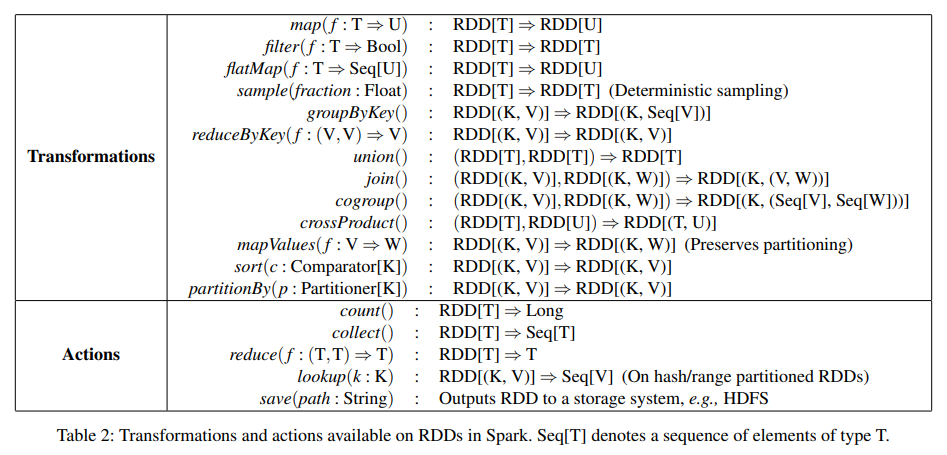

# Mark 1
Mostly aimed at getting a hang of Go and spark syntax + eco system. This is gonna be more of a reverse engineering effort rather than implementation effort.

### Rough notes
* Spark Core: Main entry point for the spark eco system
* RDD is a very important component of Spark eco system
* Spark RDD features
  * in memory computation
  * lazy evaluation
  * fault tolerance
  * immutability (RDDs cannot be modified. They can be transformed)
  * persistence (cache ferquently used RDDs)
  * partitioning (records are partitioned logically)
  * location stickiness (partition data such that tasks are close to their data)
  * coarse-grained ops (transformations to all the rows and not jsut a single ele). DSM (Dist Shared Mem)
  * typed RDDs
  * no limit on Nos of RDDs. Limit is on memory

### Lims
* No file management system (use HDFS)
* Less no of Algos (wtf does that mean)
* manual optimization

### Imp sources
* https://cs.stanford.edu/~matei/papers/2012/nsdi_spark.pdf
  * Make a facile implementation from here
* https://people.csail.mit.edu/bzhou/publication/report_spark.pdf
  * MIT CSAIL paper explaining the implementation

#### Feature Map
#### Transformations
* [ ] map
* [ ] filter
* [ ] flatMap
* [ ] sample
* [ ] groupByKey
* [ ] reduceByKey
* [ ] union
* [ ] join
* [ ] cogroup
* [ ] crossProduct
* [ ] mapValues
* [ ] sort
* [ ] partitionBy

#### Actions
* [ ] count
* [ ] collect
* [ ] reduce
* [ ] lookup
* [ ] save

#### Logs

* Dt. 27 oct: Instead of haphazarly looking here and there, I'll start by defining a data structure for my go-spark stuff